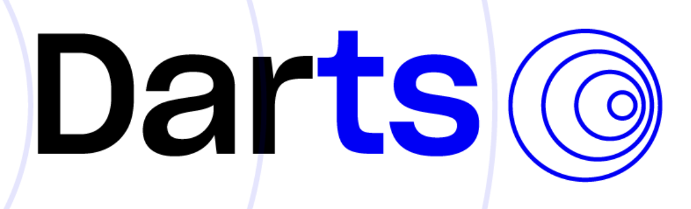

# Data Scientist

**[MSc Computer Science @ ETH Zürich](https://ethz.ch/en.html)**  
**Machine Intelligence & Data Management**

[](https://www.linkedin.com/in/dustinbrunner) 
[](https://github.com/brunnedu)

---

## Overview
- [Hey There!](#hey-there)
- [Skills](#skills)
- [Education](#education)
- [Experience](#experience)
- [Projects](#projects)
  - [Recommender Systems for Swiss Politics](#recommender-systems-for-swiss-politics)
  - [DataComp Challenge](#datacomp-challenge)
  - [BasketXplainer](#basketxplainer)
  - [Darts Forecasting Library](#darts-forecasting-library)
  - [Distance-Preserving Graph Embedding](#distance-preserving-graph-embedding)
- [Achievements](#achievements)
- [Hobbies](#hobbies)

---

## Hey There!

I’m a Master's student in Computer Science at ETH Zürich, specializing in **Machine Intelligence** and **Data Management**. My expertise lies at the intersection of computer science and statistics, where I apply my skills in **machine learning**, and **big data technologies** to solve real-world problems and create effective solutions.

I have practical experience in data engineering, machine learning, and forecasting, including contributions to the **Darts forecasting library** and developing tools for industries such as logistics and energy.

Feel free to connect if you’re interested in collaborating! I’m eager to explore new challenges, particularly in **Data Science**, **Quantitative Finance**, or **Big Data Engineering** roles.
<p align="center">
  <a href="https://www.linkedin.com/in/dustinbrunner" target="_blank">
    
  </a>
  <a href="https://github.com/brunnedu" target="_blank">
    
  </a>
  <a href="https://scholar.google.com/citations?user=G4x3x_0AAAAJ" target="_blank">
    
  </a>
</p>

---

## Skills

- **Languages**: Python, C++, Java, R, Typescript
- **Frameworks & Libraries**: PyTorch, NumPy, Pandas, Optuna, Plotly, Hugging Face, tidyverse
- **Data Management**: SQL, Spark, Hadoop, HBase, MongoDB, Neo4j
- **Other**: Git, Docker, Bash, MLOps, CI/CD, GitHub Actions, Notion, Jira
- **Focus Areas**: Forecasting, Visualization, Explainability, Causal Inference, Natural Language Processing (NLP), Graph Neural Networks
- **Languages**: German (Native), English (Proficient), French (Elementary)

---

## Education

**ETH Zürich**  
*Master of Science in Computer Science* (2022 - 2024)  
**Major**: Machine Intelligence | **Minor**: Data Management  
*GPA*: 5.46 / 6.0  

**ETH Zürich**  
*Bachelor of Science in Computer Science* (2018 - 2021)

---

## Experience

### Unit8 | Data Scientist  
*Sep 2021 - Aug 2022* | Zürich, Switzerland  
- Developed and implemented a route planning tool using **PySpark** and **Palantir Foundry**, optimizing logistics for a newspaper company.
- Core contributor to the **Darts** library, optimizing model efficiency while reviewing pull requests, suggesting enhancements, and improving documentation.
- Collaborated with clients to deliver high-impact data solutions in energy and manufacturing sectors.

---

## Projects

### Recommender Systems for Swiss Politics
*Master’s Thesis* (Feb 2024 - Aug 2024) | Paper _(confidential - under submission)_  
Identified 11 vulnerabilities in **Smartvote**, a Swiss voting advice application, with
some allowing for more than 3.5x visibility gains for individual parties. Proposed 10
mitigations that significantly reduce or eliminate these vulnerabilities. Findings are
being adopted in Smartvote’s redesign for the next elections.  
**Technologies**: Python, Pandas, D-Tale, SciPy, Optuna, Plotly, LaTex, Notion

### DataComp Challenge
*Semester Project* (Sep 2023 - Dec 2023) | [Report](https://pub.tik.ee.ethz.ch/students/2023-HS/GA-2023-09.pdf) | [DataComp Website](https://www.datacomp.ai/)  
Ranked 4th out of 12 teams in the small track of the DataComp Challenge, an ML benchmark where the goal is to filter a CommonCrawl image-text dataset to train a **CLIP** model evaluated on 38 zero-shot downstream tasks, using a combination of cross-modality filtering and content alignment.  
**Technologies**: Python, PyTorch Lightning, SLURM (Cluster), CLIP (Contrastive Language-Image Pretraining)

### BasketXplainer
*Interactive ML Project* (Feb 2023 - Jul 2023) | [Interactive Demo](http://b5-winning-in-basketball.course-xai-iml23.isginf.ch/) | [Paper](https://rdcu.be/dXhu2) | [GitHub](https://gitlab.inf.ethz.ch/course-xai-iml23/b5-winning-in-basketball)  
Developed an interactive dashboard to predict basketball game outcomes based on in-game stats and explain predictions using SHAP values. Users could modify team statistics to explore **what-if scenarios**.  
**Technologies**: Python, scikit-learn, SHAP, Flask, Javascript, React, Gitlab Pipelines

### Darts Forecasting Library
*Open-Source Contributor* (Sep 2021 - Aug 2022) | [Documentation](https://unit8co.github.io/darts/) | [GitHub](https://github.com/unit8co/darts)  
Core contributor to the open-source time series forecasting library Darts by Unit8. Optimized the most popular regression forecasting models by vectorizing computations achieving a speedup of up to 400x.  
**Technologies**: Python, PyTorch, scikit-learn, Matplotlib, Git, GitHub Actions, CI/CD
```bash
pip install darts
```




### Distance Preserving Graph Embedding
*Bachelor’s Thesis* (Feb 2021 - Aug 2021) | [Report](https://pub.tik.ee.ethz.ch/students/2021-FS/BA-2021-17.pdf)  
Developed a model that enables constant-time approximate shortest path distance
queries on road networks, achieving an average mean relative error of less than 10%.  
**Technologies**: Python, PyTorch Geometric, (Hyperbolic) Graph Convolutional Networks ((H)GCNs)

---

## Achievements

- **Advanced Machine Learning Projects (2023)**: Ranked 1st place twice and 7th place once out of >100 teams in competitively graded
practical projects for the Advanced Machine Learning course at ETH Zürich.
- **Mathematics Kangaroo Switzerland (2015)**: Ranked 40th out of 5,787 students in Switzerland’s largest mathematics competition.

---

## Hobbies

- **Sports**: Squash, badminton, gym, padel tennis, table tennis
- **Interests**: Coding, astrophotography, music, chess, geoguessr, learning new things
- **Social Activities**: Board game night with friends, enjoying good conversations over dinner